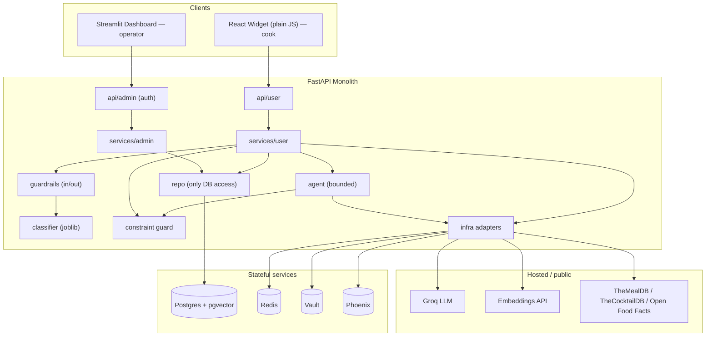
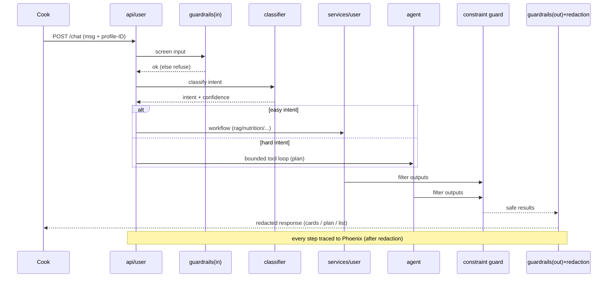
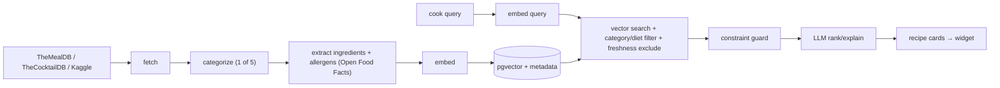
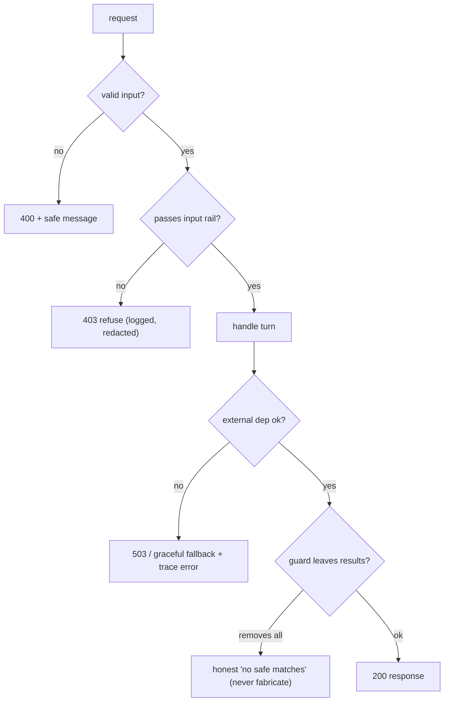

# Sous-Chef AI — SpecKit Specification & Plan

> **Authoritative spec document.** Single source of truth for Sous-Chef. It consolidates and supersedes
> notes in the companion docs ([amer_idea-1.md](amer_idea-1.md), [amer_idea-1-tech.md](amer_idea-1-tech.md),
> [model_role.md](model_role.md), [structure.md](structure.md), [CLAUDE.md](CLAUDE.md)). Where any conflict,
> **this file wins**. The Constitution (Section 1) outranks every other section.

> **How to use this file:** run the Constitution once, then work **one phase at a time**. Each phase in
> Section 4 ships with its own paste-ready `/speckit.specify`, `/speckit.plan`, and `/speckit.tasks`
> commands plus the features it delivers. Do **not** paste the whole project into a single cycle.

---

## Table of Contents
1. SpecKit Constitution
2. How SpecKit Is Used (Execution Model)
3. Project Definition
4. The Plan — Phase by Phase (paste-ready SpecKit commands)
5. Architecture
6. AI Engineering
7. Specification Change Log

---

## 1. SpecKit Constitution

The Constitution is the **highest-priority artifact**. Every spec, plan, task, and line of code must
conform to it. If a feature violates a principle, the principle wins and the feature is cut or reshaped.

### P1 — Simplicity Over Complexity
- **Description:** Prefer the simplest design that satisfies the requirement.
- **Why:** Solo, 2-week, junior project — complexity is the main risk to shipping.
- **Effect:** Monolith over microservices; pgvector in Postgres; docker-compose not Kubernetes; one agent.

### P2 — Build Only What Is Required
- **Description:** Implement exactly the MVP features — nothing speculative.
- **Why:** Scope creep turns 2-week projects into 6-week projects.
- **Effect:** Features frozen to this spec; new ideas go to "Future," not this build.

### P3 — Clear Separation of Concerns
- **Description:** Each module has one job; layers don't reach around each other.
- **Why:** Auditable boundaries make the safety wall and grounding provable and the code testable.
- **Effect:** Strict `api → services → repo → infra`; `repo/` is the only DB access; `services/user` vs `services/admin`.

### P4 — Testability
- **Description:** Every critical behavior has an automated test; safety behaviors are gated.
- **Why:** "It worked in the demo" is not evidence; wall/grounding regressions matter most.
- **Effect:** Adapters mockable; guard/freshness/redaction/shopping-list unit-tested; red-team + redaction gate CI.

### P5 — Reproducibility
- **Description:** Anyone can clone and run it identically; deterministic where it should be.
- **Why:** A grader must be able to run it; "works on my laptop" disqualifies.
- **Effect:** `docker-compose up` from a fresh clone; Alembic schema; pinned deps; committed thresholds; SHA-pinned model.

### P6 — Security & Privacy by Default
- **Description:** Safe is the default; you opt into exposure, never into protection.
- **Why:** The chat box is public, untrusted input; cooks paste personal data.
- **Effect:** Vault secrets; PII redaction before logs and traces; guardrails; parameterized queries; bounded loop.

### P7 — Maintainability
- **Description:** Readable, consistent, changeable by a newcomer.
- **Why:** You must answer for any line on demo day.
- **Effect:** Consistent structure; prompts in `prompts/`; lint + type-check; small single-purpose files.

### P8 — Documentation-First Development
- **Description:** Write the spec/contract before the code; keep docs in sync.
- **Why:** A spec written first is a thinking tool; a drifted doc is a lie.
- **Effect:** Specs precede code; when code and spec disagree, fix the spec first or regenerate.

### P9 — Spec-Driven Development
- **Description:** The specification — not the code — is the source of truth, via SpecKit.
- **Why:** The market values "specify, generate, review" over hand-typing every line.
- **Effect:** Each phase runs specify → plan → tasks → implement; artifacts committed; no vibe coding.

### P10 — No Unnecessary Technologies or Features
- **Description:** Every technology must earn its place by solving a stated problem.
- **Why:** Résumé-driven dependencies bloat the build and the attack surface.
- **Effect:** No torch/transformers in any container; no dedicated vector DB; no Kubernetes; no blob store; no full end-user auth.

---

## 2. How SpecKit Is Used (Execution Model)

### Purpose
SpecKit is a **spec-driven development toolkit**. You write *what* and *why*; an AI agent generates the
plan, tasks, and implementation *from* that spec. The spec — not the code — is the source of truth.

### The chain
```
Constitution      = the rules every artifact obeys (Section 1) — run ONCE
/speckit.specify  = WHAT & WHY for a slice of work (a phase here)
/speckit.plan     = HOW to build that slice (architecture, stack, data, APIs)
/speckit.tasks    = ordered, reviewable units of work derived from the plan
/speckit.implement= code generated against the tasks, reviewed and owned by you
```
Each stage constrains the next; anything conflicting with the Constitution is rejected.

### Execution model — phase by phase (THE key decision)
- **One Constitution, set once.** It governs every phase.
- **One specify → plan → tasks → implement cycle per PHASE** (Section 4). Each `/speckit.specify` creates
  its own feature branch + `specs/NNN-*/` folder, so phases are naturally isolated and reviewable.
- **Phases sequence the work; features live inside a phase.** Each phase lists the features it delivers,
  and its specify/plan cover exactly those features — no more.
- **Do NOT** put the whole project into one cycle (P2/P3 violation; unreviewable plan + task list).
- **Optional finer split:** if a phase feels too big (e.g. Phase 3), you may split its specify into 2–3
  feature-level cycles using the same blocks. Default is one cycle per phase.

### Solo workflow
```
Idea
  ↓  (once) /speckit.constitution
  ↓
For each phase 1..7:
  /speckit.specify  → requirements for the phase   (review/edit)
  /speckit.plan     → technical design for the phase (check vs Constitution)
  /speckit.tasks    → ordered tasks                  (small, reviewable)
  /speckit.implement→ build task-by-task; commit specs beside code
  Testing           → make lint && make test && make evals (gates pass)
  ↓
Deployment (Phase 7) → green main auto-deploys to Railway
```

### Common mistakes to avoid
- One giant spec for everything (P2/P3). Specify per phase.
- Over-specifying future features into the MVP (P2) — park them in "Future."
- Editing code without updating the spec (P8) — regenerate instead.
- Weakening an eval threshold to make CI green (P4) — fix the cause.
- Adding a dependency with no requirement behind it (P10).

---

## 3. Project Definition

### Problem
Home cooks fall into a rut — the same few dinners — because *finding* something new that fits their
constraints (diet, allergies, time, servings) is tedious, and exploring unfamiliar cuisines is exactly
where hidden allergens are most dangerous. So people give up and make the stir-fry again.

### Target users
- **Maya — adventurous home cook (primary):** dietary constraints, bored of her rotation, wants to try
  new cuisines safely and fast.
- **Sam — planner who wants variety (secondary):** cooks for two, plans the week, wants a varied plan + one shopping list.
- **Developer-operator (you):** operates and evaluates via the dashboard and Phoenix.

### Business value
A focused, learnable slice of a proven product space (Mealime, Paprika, Samsung Food, Yummly) that
demonstrates end-to-end AI engineering — the portfolio a junior AI engineer needs.

### Core objectives
Grounded discovery (real recipes only) · a hard allergen/diet wall · occasion-first 5-category browsing ·
a bounded meal-plan agent + correct shopping list · persistent favorites + cross-session freshness · a
trained, defended router classifier · a reproducible, observable, deployed, eval-gated system.

### Success criteria
All CI gates green (classifier F1; agent tool-selection; RAG hit@k + faithfulness; **red-team 100%
refused**; redaction; smoke); `docker-compose up` from a fresh clone; a live Railway URL; the full demo
runs end to end.

### Scope (in) / Out of scope
**In:** the features in Section 4. **Out:** real accounts/OAuth, pantry awareness, image input, grocery
ordering, personalization beyond freshness, multi-language, mobile, payments, social.

---

## 4. The Plan — Phase by Phase (paste-ready SpecKit commands)

> Run the Constitution command first (once). Then do each phase's three blocks in order, review the
> generated artifacts, run `/speckit.implement`, and pass the gates before moving on. Suggested feature
> branch / folder per phase shown as `→ specs/NNN-*`.

### Run ONCE — `/speckit.constitution`
```
/speckit.constitution
Adopt these ten principles for Sous-Chef; they outrank all specs, plans, tasks, and code:
P1 Simplicity over complexity. P2 Build only what is required. P3 Clear separation of concerns
(api→services→repo→infra; repo is the only DB access; services split into user/ and admin/).
P4 Testability (safety behaviors are gated in CI). P5 Reproducibility (one-command run; pinned deps;
committed eval thresholds). P6 Security & privacy by default (Vault secrets; PII redaction before logs
AND traces; guardrails; parameterized queries; bounded agent loop). P7 Maintainability. P8
Documentation-first. P9 Spec-driven development (no vibe coding). P10 No unnecessary technologies or
features (no torch in any container; no dedicated vector DB; no Kubernetes; no full end-user auth).
The non-negotiables: never surface a recipe that violates a stated allergy/diet; never invent recipes or
steps; LLM and embeddings are hosted-API calls; the trained classifier is served lean via joblib.
keep the code clean and simple and use clear naming for the files and folders.
```

---

### PHASE 1 — Foundation  → `specs/001-foundation`
**Objective:** a runnable, observable, deployable monolith skeleton.
**Features:** repo + SpecKit scaffold; layered FastAPI skeleton + `/health`; docker-compose
(Postgres/pgvector, Redis, Vault, Phoenix); Vault secrets adapter; Phoenix/OTel tracing; Alembic
baseline; CI skeleton; Railway hello-world deploy; `eval_thresholds.yaml` placeholders.
**Effort:** ~2 days. **Dependencies:** none.

```
/speckit.specify
Establish the Sous-Chef foundation: a runnable, reproducible, secure-by-default monolith skeleton.
WHAT: a FastAPI service that boots, exposes GET /health, connects to Postgres (with pgvector), Redis,
Vault, and a tracing backend, and is deployable to a public URL. It must read all secrets from Vault
(never env/code), emit a trace for each request, and come up cleanly with one command from a fresh clone.
WHY: reproducibility (P5) and security/privacy by default (P6) must exist from the first commit, and
observability is cheaper to wire early than to retrofit.
ACCEPTANCE:
- `docker-compose up` from a clean checkout starts backend + postgres(pgvector) + redis + vault + phoenix.
- GET /health returns 200 and is used as the deploy healthcheck.
- A sample request produces a trace; no secret value appears in any log or trace.
- CI runs lint + type-check + a smoke test and is green; a hello-world build deploys to the host platform.
CONSTRAINTS: no business logic yet; no torch; secrets only in the secret store; keep images small.
```
```
/speckit.plan
Implement the foundation per the Constitution (monolith, simple).
STACK: FastAPI + Pydantic; SQLAlchemy + Alembic; PostgreSQL + pgvector; Redis; HashiCorp Vault (hvac);
Arize Phoenix (self-hosted, OpenTelemetry/OpenInference) with traces persisted to the same Postgres.
STRUCTURE: app/main.py (app factory, middleware, tracing init, lifespan); app/config.py (Pydantic
settings, non-secrets only); app/api/health.py; app/infra/{db,cache,vault,tracing}.py; app/core/{logging,
redaction,errors}.py; alembic/ baseline migration.
DEPLOY: docker-compose.yml for local (5 services); Dockerfile for the backend; railway.toml; deploy a
hello-world backend to Railway with GET /health as healthcheck.
CI: .github/workflows/ci.yml — ruff + mypy + a stack smoke test; eval_thresholds.yaml with placeholders.
SECURITY: Vault adapter resolves all secrets; .env.example holds only Vault address/token + service URLs;
redaction utility stubbed and called by logging and the tracing exporter.
TESTING: a smoke test that boots the app and hits /health.
```
```
/speckit.tasks      # generate ordered tasks from the plan, then /speckit.implement
```

---

### PHASE 2 — Core Features (data + non-AI product)  → `specs/002-core`
**Objective:** the corpus, the safety wall, and the browse/favorites surface — no AI yet.
**Features:** ingestion (TheMealDB + TheCocktailDB + a Kaggle subset) with 5-category tagging; ingredient
extraction + nutrition/allergen mapping (Open Food Facts); schema + migrations; **constraint guard (the
wall)** + tests; category browse + recipe detail (DB-backed); favorites CRUD; passwordless profile +
seen-history tables.
**Effort:** ~3 days. **Dependencies:** Phase 1.

```
/speckit.specify
Deliver Sous-Chef's data layer, the safety wall, and the non-AI product surface.
USER STORIES:
- As a cook, I set my diet, allergies, and servings once so every result respects them.
- As a cook, I pick one of five categories (hot drink, cold drink, breakfast, lunch, dinner) and see a
  list of REAL recipe cards (title + key ingredients).
- As a cook, I click a card to see its full stored step-by-step instructions and nutrition.
- As a cook, I save recipes to favorites and find them later, even in a new session.
FUNCTIONAL REQUIREMENTS:
- Each recipe is tagged to exactly one of the five categories at ingestion.
- The constraint guard removes any recipe violating the cook's allergies/diet on EVERY output path.
- Recipe detail renders stored steps verbatim (no invention) plus derived nutrition.
- Favorites CRUD (save/list/open/remove) persists per passwordless profile across sessions.
ACCEPTANCE:
- Given a nut-allergic cook, no nut-containing recipe is ever shown by any feature.
- A saved favorite survives a page reload / new session.
- Every recipe in the corpus has a category, parsed ingredients, allergen tags, and nutrition.
CONSTRAINTS: public/free data only; the wall is deterministic code, not a prompt; no semantic search yet.
```
```
/speckit.plan
DATA SOURCES: TheMealDB (food → breakfast/lunch/dinner); TheCocktailDB non-alcoholic (→ hot/cold drink);
a Kaggle subset (RecipeNLG or Food.com) for corpus volume; Open Food Facts (nutrition + allergens).
INGESTION (ingestion/): fetch_* → categorize (1 of 5) → extract_ingredients (name,qty,unit) →
map nutrition + detect allergens → store. Idempotent; run via run_ingest.py.
SCHEMA (app/models + alembic): recipes(category, cuisine, time, steps...), ingredients(allergen_tags),
nutrition_cache, profiles, favorites(profile_id,recipe_id), seen_history(profile_id,recipe_id,ts).
SERVICES (app/services/user): constraint_guard (deterministic filter), favorites, nutrition; shared/
recipe_view (DTOs). REPO (app/repo): recipes, favorites, seen_history, profiles.
API (app/api/user): GET /recipes (by category, DB-backed list), GET /recipes/{id}, POST/GET/DELETE
/favorites; profile-ID header via app/api/deps.py.
TESTING: unit test the constraint guard (incl. a "new output path forgets the guard" regression) and
favorites persistence.
```
```
/speckit.tasks      # then /speckit.implement, then: make test (guard + favorites must pass)
```

---

### PHASE 3 — AI Integration  → `specs/003-ai`
**Objective:** make it intelligent — semantic discovery, routing, and planning.
**Features:** RAG (embeddings → pgvector, metadata pre-filter, one improvement) upgrading search;
**freshness** (seen-history exclusion); the **trained intent classifier** (offline + LLM baseline + joblib
serving) as the router; the **bounded agent** + tools + Redis session memory (meal plan + shopping list +
substitutions); **guardrails** input/output rails; versioned prompts.
**Effort:** ~4 days. **Dependencies:** Phase 2 (corpus + wall).

```
/speckit.specify
Add Sous-Chef's intelligent behavior on top of the Phase 2 data and wall.
USER STORIES:
- As a cook, I type a request ("something Thai I haven't made") and get a ranked list of real recipes.
- As a cook, repeating a request returns DIFFERENT recipes, so discovery stays fresh.
- As a cook, I ask for a multi-day meal plan that varies across cuisines, with one consolidated,
  deduplicated shopping list scaled to my servings.
- As a cook, I ask for an ingredient substitution that never introduces an allergen.
FUNCTIONAL REQUIREMENTS:
- Retrieval grounds every recommendation in real recipes; results are pre-filtered by category/diet.
- Freshness excludes already-seen recipes until the pool is exhausted, then resets; favorites are exempt.
- A trained classifier routes each message: easy intents → deterministic workflow; hard/multi-step →
  one bounded tool-calling agent (tools: search_recipes, get_recipe, get_nutrition, build_shopping_list,
  substitute_ingredient), with capped iterations + tokens and schema-validated tool inputs.
- Input/output guardrails refuse prompt-injection, jailbreak, and allergen-override attempts.
ACCEPTANCE:
- The same query twice returns new recipes. A meal-plan request yields ≥3 cuisines, all constraint-safe,
  with one scaled shopping list. "Ignore my allergy / ignore previous instructions" is refused.
CONSTRAINTS: API-only inference; the classifier is trained offline and served via joblib (no torch).
```
```
/speckit.plan
RAG (app/services/user/rag.py): embed corpus (hosted embeddings API — separate provider, Groq is
chat-only) into pgvector with metadata (category, diet, allergen, cuisine); query embed → vector search →
metadata pre-filter → one improvement (rerank OR metadata filter) reported as a number on a golden set.
FRESHNESS (freshness.py): exclude seen-history IDs; over-fetch + diversify; reset on exhaustion.
CLASSIFIER (ml/ offline → app/classifier/): TF-IDF + logistic regression vs LLM zero-shot baseline on
macro-F1/latency/cost; ship winner as model.joblib + model_card.md (SHA-256). Router in services/user/router.py.
AGENT (app/agent/): bounded loop + tools.py (Pydantic-validated); Redis session memory with a justified
TTL; meal_plan.py orchestrates; shopping_list.py (aggregate+dedupe+scale); nutrition + substitution.
LLM: Groq adapter (app/infra/llm_groq.py). GUARDRAILS (app/guardrails/): input rails (injection/jailbreak)
+ output rails (leak check → redaction). PROMPTS: prompts/ version-controlled (agent_system, recipe_explainer, substitution).
TESTING: freshness reset; shopping-list math; agent tool-selection on a small golden set.
```
```
/speckit.tasks      # then /speckit.implement
```

---

### PHASE 4 — Testing & UI  → `specs/004-testing-ui`
**Objective:** prove it with gated evals and ship both user surfaces.
**Features:** all eval suites + CI gates (classifier F1; agent tool-selection; RAG hit@k + faithfulness;
**red-team allergen+injection 100% refused**; redaction; smoke); unit/integration tests; **React widget**
(plain JS: category chips, cards→detail, favorites, profile-ID); **Streamlit dashboard** (cookie auth that
survives refresh; corpus; eval runner; metrics; Phoenix deep-links).
**Effort:** ~3 days. **Dependencies:** Phase 3.

```
/speckit.specify
Make Sous-Chef provable and usable: gated evaluations plus the two UIs.
USER STORIES:
- As the operator, I browse the corpus, run eval suites on demand, and inspect traces/cost — and a page
  refresh does not log me out.
- As a cook, I use a chat widget: pick a category, see recipe cards, click for full steps, save favorites.
REQUIREMENTS:
- Eval suites with committed thresholds gate CI: classifier macro-F1; agent tool-selection; RAG
  (hit@k, MRR, faithfulness, answer relevancy); red-team (allergen-override + injection/jailbreak — ALL
  must be refused); redaction (a pasted fake secret never appears unredacted in logs or traces); stack smoke.
- The React widget is plain JavaScript/JSX (no TypeScript), talks only to the backend, and attaches the
  profile-ID header. The Streamlit dashboard is login-protected with a cookie that survives refresh.
ACCEPTANCE: every gate is enforced in CI and blocks merge on regression; both UIs work against the backend.
CONSTRAINTS: no new runtime dependencies beyond eval/test/UI; keep the wall and grounding tests as the hard gates.
```
```
/speckit.plan
EVALS (evals/): classifier/testset.csv; agent_tool_selection/cases.yaml; rag/golden.yaml (RAGAS or a
frozen judge); redteam/attempts.yaml; redaction/cases.yaml; run_evals.py compares to eval_thresholds.yaml
and exits non-zero on failure.
TESTS (tests/): unit (constraint_guard, freshness, shopping_list, redaction); integration (chat_flow,
favorites); redteam/test_attempts.py drives the hard gate.
CI (.github/workflows/ci.yml): lint → type-check → build → run all gates; tighten thresholds with real numbers.
WIDGET (widget/, plain JS/JSX): vite.config.js, src/{main,App}.jsx, api/client.js, lib/profile.js,
components/{CategoryChips,ChatBox,RecipeCard,RecipeDetail,Favorites}.jsx.
DASHBOARD (dashboard/): app.py + auth.py (streamlit-authenticator cookie login) + pages (corpus, evals,
metrics with Phoenix deep-links); api/admin endpoints (corpus, evals/run, metrics) behind admin_deps.py.
```
```
/speckit.tasks      # then /speckit.implement, then: make lint && make test && make evals (all green)
```

---

### PHASE 5 — Operability & Model Flexibility  → `specs/005-pgadmin-and-openai`
**Objective:** make the running system easier to operate and the LLM provider a one-line swap — without
adding weight or breaking the wall.
**Features:** a **pgAdmin** service in the local stack for visual DB inspection/repair (local/dev only,
never deployed); a **provider-agnostic LLM seam** so chat generation runs on **Groq OR OpenAI**, chosen by
a single config value with no code change, both serving the identical tool-calling contract; OpenAI key in
Vault; docs + a tiny contract test that both adapters satisfy.
**Effort:** ~1.5 days. **Dependencies:** Phase 3 (the LLM + agent it abstracts); Phase 1 (the compose stack).

```
/speckit.specify
Add operability and model flexibility to Sous-Chef without growing the stack or touching safety.
WHAT:
- A pgAdmin web UI wired to the existing Postgres so the operator can inspect/repair the corpus,
  favorites, and seen-history visually instead of raw psql. It is a LOCAL/DEV convenience only and is
  never part of the deployed (Railway) stack.
- A provider-agnostic LLM seam: the chat/agent generation provider is selectable between Groq (default)
  and OpenAI by ONE setting (e.g. LLM_PROVIDER), with zero call-site changes. Both providers expose the
  same `chat(messages, tools?, max_tokens?, model?)` contract and the same native tool-calling shape, so
  the router, RAG explainer, and bounded agent are unaware of which one is active.
WHY:
- Operability (P7): a junior operator must be able to see and fix data on demo day without memorizing SQL.
- Resilience & portability (P1/P10): a single hosted LLM is a single point of failure and a single bill;
  a clean seam lets you fail over, A/B tool-call reliability and cost, and avoid lock-in — at no extra
  dependency, since the `openai` SDK is already vendored for embeddings.
USER STORIES:
- As the operator, I open pgAdmin, browse tables, and run a query to confirm a recipe's allergen tags.
- As the operator, I switch the LLM provider from Groq to OpenAI by changing one config value and
  restarting — every chat turn, meal plan, and tool call keeps working unchanged.
FUNCTIONAL REQUIREMENTS:
- pgAdmin connects to the existing `postgres` service; its server connection is pre-provisioned so it
  works on first boot; it is excluded from the production deploy.
- The LLM seam picks the provider from config at startup; an unknown/missing value fails fast with a clear
  error. The OpenAI API key is read from Vault (never env/code/image), exactly like GROQ_API_KEY.
- The tool-calling contract (tool specs, validated tool inputs, bounded loop, wall) is identical across
  providers; swapping the provider changes neither behavior contracts nor the safety guarantees.
ACCEPTANCE:
- `docker-compose up` brings up pgAdmin alongside the stack; it is reachable locally and pre-connected to
  Postgres; the deployed stack does NOT include it.
- With LLM_PROVIDER=openai the full demo (search, nutrition, substitution, a meal plan) runs end-to-end;
  flipping back to groq also runs end-to-end — no code change between the two.
- A contract test asserts both adapters satisfy the same interface and return tool calls in the same shape.
- No secret (OpenAI key, pgAdmin password) appears in any log, trace, image, or `.env.example`.
CONSTRAINTS: no torch; no new runtime Python dependency for OpenAI chat (reuse the vendored `openai` SDK);
pgAdmin is local-only; the wall and guardrails stay deterministic and provider-independent (golden rules
1, 2, 4); prompts stay in `prompts/` and unchanged by the swap.
```
```
/speckit.plan
LLM SEAM (app/infra/llm/): introduce a small provider package — base.py (an `LLMClient` Protocol with
`chat(messages, *, tools=None, max_tokens=None, model=None)`), groq.py (the existing Groq adapter moved
here, Vault GROQ_API_KEY, 429 retry kept), openai.py (new, using the already-vendored `openai` SDK +
Vault OPENAI_API_KEY), and a `get_client()` factory selecting by `settings.llm_provider`. Keep a stable
module-level facade `app/infra/llm.chat(...)` so existing callers (services/user/rag.py,
app/agent/loop.py) and tests depend on ONE seam and need no edits beyond the import; tests monkeypatch
`llm.chat`. CONFIG (app/config.py, non-secrets): `llm_provider` (groq|openai, default groq),
`openai_model`, `openai_agent_model`; document them in .env.example next to the GROQ_MODEL knobs. SECRET:
add OPENAI_API_KEY to scripts/seed_vault.sh and the VaultAdapter lookups; .env.example only notes it is a
Vault secret. DEPENDENCIES: none new — `openai>=2.41.0` is already in the backend group (embeddings).
PGADMIN (docker-compose.yml): add a `pgadmin` service (dpage/pgadmin4) under a `local`/dev profile,
depends_on postgres, published on a local port, with PGADMIN_DEFAULT_EMAIL/PASSWORD as local-only
convenience env in .env.example (NOT Vault, NOT deployed) and a mounted servers.json pre-provisioning the
Postgres connection. Exclude it from the Railway service set (Phase 7). Add a `make pgadmin` convenience
note and a RUNBOOK entry. TESTING: a fake `LLMClient` for unit/integration tests; a contract test that
both real adapters satisfy the Protocol and emit the same tool-call shape (mock transport, no network);
optionally parametrize the agent tool-selection eval by provider (report-only). DOCS: DECISIONS.md (why a
seam + the swap mechanism, with the tool-call-reliability/cost rationale), SECURITY.md (OpenAI key in
Vault; pgAdmin local-only, never exposed in prod), RUNBOOK.md (open pgAdmin; flip the provider).
```
```
/speckit.tasks      # then /speckit.implement, then: make lint && make test && make evals (all green, both providers)
```

---

### PHASE 6 — Corpus Data Quality (Nutrition & Images)  → `specs/006-nutrition-and-images`
**Objective:** make every surfaced recipe trustworthy to look at and read — real (or honestly-absent)
nutrition and a real (or honestly-generic) image — without ever fabricating either.
**Features:** a curated **USDA nutrition fallback** (per-100g macros + average per-item / per-count-unit
gram weights) that widens ingestion's approximate aggregation so common ingredients and count units
("2 cloves garlic", "1 egg") stop collapsing recipes to all-zeros; an **authoritative nutrition
data-source upgrade** — swap the names-only RecipeNLG Kaggle subset for the **Food.com RAW_recipes**
dataset (per-ingredient quantities **and** a per-serving nutrition column → exact macros via the existing
`from_food_com` path); an **honest coverage display** ("estimated from N of M ingredients" vs a true
"not available"); a **recipe-image fallback** that shows the real source image when present and a
clearly-generic per-category placeholder otherwise — never a stock/borrowed photo passed off as the dish;
idempotent re-ingest + a **nutrition backfill script** for the existing corpus.
**Effort:** ~2 days. **Dependencies:** Phase 2 (ingestion, corpus, nutrition, recipe_view + the wall);
Phase 4 (the widget that renders cards/detail).

```
/speckit.specify
Raise the data quality of Sous-Chef's corpus so no recipe shows a false or broken fact — nutrition or
image — while never inventing one.
WHAT:
- Nutrition coverage: many recipes show "Nutrition data isn't available" because ingestion's approximate
  aggregation can't map common ingredient names (Open Food Facts misses them) or count units that carry
  no mass ("2 cloves garlic", "1 egg"), so totals collapse to zero. Add a curated, AUTHORITATIVE fallback
  (USDA FoodData Central per-100g macros + average per-item / per-count-unit gram weights) consulted only
  when Open Food Facts has nothing — widening coverage WITHOUT fabricating values and keeping every
  aggregated total flagged approximate.
- Authoritative source: the current Kaggle subset (RecipeNLG) lists ingredient NAMES with no quantities,
  so its recipes are nutrition-uncomputable from ingredients at all. Replace it with the Food.com
  RAW_recipes dataset, which carries per-line quantities AND a per-serving nutrition column, so those
  recipes get EXACT nutrition through the existing authoritative path.
- Honest coverage: when only some ingredients were measured, the detail view and the chat reply say
  "estimated from N of M ingredients"; only when nothing could be measured do they say nutrition is
  unavailable. Never show a fabricated or misleading number.
- Images: many recipes have no image (only TheMealDB/TheCocktailDB ship image URLs; the Kaggle source does
  not), so cards/detail render empty or broken. Show the recipe's real source image when present;
  otherwise a neutral, clearly-generic per-category placeholder with descriptive alt text. Never fetch or
  display a stock/AI/borrowed photo as if it were this specific dish (grounding).
WHY:
- Grounding & honesty (golden rule #2, P6): a wrong calorie count or a photo of a different dish is a
  fabricated fact a cook acts on; an honest "estimated from N of M" or a generic placeholder tells the truth.
- Trust & usability (P7): a wall of "not available" and missing images makes a real product look broken.
- Build only what's required (P2/P10): the fix is curated static data + a data-source swap + a UI
  fallback — no new runtime dependency, no image service, no torch.
USER STORIES:
- As a cook, opening a recipe I see real calories/macros, or an honest note that only part of it could be
  measured, or — only if truly unknown — that nutrition isn't available; I never see a made-up number.
- As a cook, every card and detail shows a picture: the real dish photo when the source has one, else a
  tasteful category placeholder — never a broken image and never a photo of some other dish.
- As the operator, I refresh the corpus (or run a backfill) and watch the "no nutrition" and "no image"
  rates drop, reproducibly from a clean run.
FUNCTIONAL REQUIREMENTS:
- The nutrition fallback is ADDITIVE: it contributes only where Open Food Facts returned nothing, draws
  every value from an authoritative reference (USDA FDC), leaves aggregated totals flagged is_approximate,
  and never overrides authoritative source nutrition.
- Count and unit-less ingredient lines resolve to grams via average per-item / per-count-unit weights for
  the common cases; genuinely variable units (can/package/piece) stay unmapped and are reported as partial
  coverage, never guessed.
- The Food.com RAW_recipes subset ingests through the existing pipeline; recipes carrying its per-serving
  nutrition column store EXACT nutrition (is_approximate = false) and their quantity-bearing lines parse
  for scaling.
- The cook-facing nutrition view distinguishes three states — complete, partial ("estimated from N of M
  ingredients"), and absent ("not available") — and the chat reply mirrors the partial-coverage note.
- Every recipe surface renders an image: source image_url when present, else a per-category placeholder;
  a failed image load falls back to the same placeholder; alt text names the recipe. No path shows a
  third-party photo as the actual recipe.
- Ingestion stays idempotent; a backfill script recomputes nutrition for the existing corpus from STORED
  ingredients (on-disk OFF cache, no live calls) without touching any other field or downgrading
  authoritative rows.
ACCEPTANCE:
- After ingesting the Food.com subset + fallback, the share of complete recipes with usable nutrition
  rises sharply, and Food.com-sourced recipes show exact (non-approximate) macros.
- A recipe with some unmappable ingredients shows totals plus "estimated from N of M ingredients"; a
  recipe with nothing measurable shows "not available"; no recipe shows invented macros.
- No card or detail shows a broken/empty image; recipes without a source photo show the category
  placeholder; no displayed image misrepresents a different dish as this recipe.
- make lint && make test pass (incl. the new fallback/coverage tests); the wall, grounding, redaction,
  and red-team gates are unchanged and green.
CONSTRAINTS: no torch and no new runtime dependency (USDA values + placeholders are committed static
assets; no runtime image/nutrition API); the wall and grounding stay deterministic and untouched;
nutrition values come only from an authoritative reference, never an LLM or a guess; placeholders must
read as generic, never as a real photo of the dish; ingestion stays idempotent and offline.
```
```
/speckit.plan
NUTRITION FALLBACK (ingestion/ingredient_nutrition_data.py): a committed module of curated USDA FoodData
Central data — NUTRIMENTS_PER_100G (energy + macros, keyed on the parser's normalized ingredient name,
using the SAME field keys as the Open Food Facts adapter so a fallback drops straight into aggregation),
ITEM_GRAMS (average mass of one whole item: egg, onion, garlic clove), COUNT_UNIT_GRAMS (stable count
units clove/slice/pinch/dash/sprig; variable units deliberately omitted). Lookups normalize + try a
singular/plural fallback, mirroring substitutions_data.py.
AGGREGATION (ingestion/nutrition.py): _grams() resolves count / unit-less lines via item then count-unit
weights AFTER the existing weight/volume path (strictly additive — only widens coverage); aggregate()
falls back to NUTRIMENTS_PER_100G when OFF returns nothing; the aggregation branch is ALWAYS
is_approximate = true (an estimate by construction) while unmapped_ingredient_count reports partial
coverage separately. The authoritative from_food_com path is unchanged and still wins via compute().
DATA SOURCE (ingestion/data + fetch_kaggle): document + switch the Kaggle subset to Food.com RAW_recipes
(per-line quantities + the 7-element per-serving nutrition column). fetch_kaggle already parses that column
into the authoritative path, so no code change — the README states Food.com is preferred precisely for
exact macros + scalable quantities (RecipeNLG is names-only and cannot yield nutrition).
COVERAGE DTO (app/schemas/recipe.py + services/user/nutrition.scale): NutritionSummary gains
unmapped_ingredient_count (>= 0, default 0); scale() passes it through verbatim (coverage is invariant
under rescaling). No migration — nutrition_cache already stores the count. Update
contracts/recipes.openapi.yaml.
COVERAGE UI (widget RecipeDetail.jsx + services/user/workflow.py): three states — totals; totals +
"estimated from N of M ingredients" when unmapped > 0 (M = rendered ingredient count); "nutrition isn't
available" only when every macro is zero. The chat nutrition reply mirrors the partial note.
IMAGES (ingestion + widget): ingestion already captures source image_url for TheMealDB/TheCocktailDB
(Food.com/RecipeNLG have none -> null). Add committed per-category placeholder assets (static SVG in the
widget) and a small helper that picks image_url or the category placeholder; RecipeCard + RecipeDetail
render  with alt = title and an onError fallback to the placeholder, with consistent sizing. No
runtime image fetching; no schema change (image_url already nullable). NEVER substitute a third-party /
stock photo for the actual dish (grounding).
BACKFILL (scripts/backfill_nutrition.py): an idempotent, offline maintenance pass that loads each complete
recipe (via repo), recomputes nutrition from its STORED ingredients against the on-disk OFF cache + the new
fallback, and replaces ONLY the nutrition_cache row through a repo helper — skipping authoritative
(is_approximate = false) rows so exact data is never downgraded. Reports before/after all-zero counts. Run
on the host against the mapped Postgres port; a full Food.com re-ingest (make ingest) is the canonical,
source-aware refresh.
TESTING: unit tests for the fallback tables + _grams count-unit resolution + aggregate's USDA fallback
(OFF stub) + the always-approximate flag + scale() passthrough; an assertion that a recipe without
image_url resolves to a category placeholder. No new eval suites; the existing wall / grounding /
redaction / red-team gates stay green and unchanged.
DOCS: DECISIONS.md (curated USDA fallback over a live API; a generic placeholder over a borrowed/stock
photo = grounding; Food.com RAW_recipes over RecipeNLG = quantities + authoritative nutrition),
RUNBOOK.md (run the nutrition backfill; refresh the corpus from Food.com), ingestion/data/README.md.
```
```
/speckit.tasks      # then /speckit.implement, then: make lint && make test (fallback + coverage green; wall/grounding/redaction/red-team unchanged)
```

---

### PHASE 7 — Deployment  → `specs/007-deployment`
**Objective:** live, reproducible, documented; tagged release.
**Features:** Railway services (backend, dashboard, Phoenix) + managed Postgres/Redis plugins; Vault seeded
on boot; green-`main` auto-deploy; docs (DESIGN, DECISIONS, EVALS, SECURITY, RUNBOOK); rehearsed demo on
the live URL; tag `v0.1.0`.
**Effort:** ~2 days. **Dependencies:** Phase 4 (CI green); Phase 5 (the pgAdmin/LLM-seam stack it ships);
Phase 6 (the data-quality corpus it deploys).

```
/speckit.specify
Ship Sous-Chef to a public URL, reproducibly and documented.
REQUIREMENTS:
- The full stack runs on the host platform at a public HTTPS URL; only a green main deploys.
- All application secrets live in Vault; managed datastore credentials are injected by the platform.
- The repo comes up from a fresh clone with one command after seeding secrets, per a written runbook.
- Documentation explains the design, decisions (with numbers), evals, security model, and how to run.
ACCEPTANCE: the demo scenario runs end-to-end on the live URL; a fresh clone reproduces locally; tag v0.1.0.
CONSTRAINTS: no Kubernetes/IaC sprawl; reuse the same Postgres for Phoenix; keep within the lean stack.
```
```
/speckit.plan
RAILWAY: one project, services = backend + dashboard + phoenix (+ static widget host); plugins =
PostgreSQL (pgvector enabled) + Redis; Vault as its own service seeded on boot (scripts/seed_vault.sh).
SECRETS SPLIT: Railway variables hold bootstrap only (Vault addr/token + managed DB/Redis URLs); Groq,
embeddings, and external API keys live in Vault. CD: GitHub integration auto-deploys main; CI gates guard it.
DOCS (docs/): DESIGN.md, DECISIONS.md (ML-vs-LLM, chunking, agent-vs-workflow — each with a number),
EVALS.md, SECURITY.md, RUNBOOK.md (compose up, seed Vault, init Phoenix, deploy).
RELEASE: rehearse the demo on the live URL; tag v0.1.0.
```
```
/speckit.tasks      # then /speckit.implement, then tag v0.1.0
```

---

## 5. Architecture

### 5.1 High-Level (monolith)


### 5.2 Component responsibilities
| Component | Responsibility |
|---|---|
| `api/user`, `api/admin` | Thin HTTP: validate, call a service, return. Admin is auth-gated. |
| `services/user` | Cook turn logic: router, workflow, rag, freshness, wall, meal_plan, shopping_list, nutrition, favorites. |
| `services/admin` | Operator logic: corpus, evals, metrics, ingestion, traces. |
| `agent` | Bounded tool-calling loop (caps iterations + tokens). |
| `classifier` | Loads `model.joblib`; returns intent + confidence (the router signal). |
| `guardrails` | Input rails (injection/jailbreak) + output rails (leak check → redaction). |
| `constraint guard` | Deterministic allergen/diet filter on every recipe output. |
| `repo` | The only DB access; parameterized queries. |
| `infra` | Adapters: Groq, embeddings, Vault, Phoenix, Postgres, Redis, external data APIs. |
| `core` | Redaction, logging, rate limiting, errors. |

### 5.3 Request flow (a chat turn)


### 5.4 Data flow (ingestion → retrieval)


### 5.5 Error handling


---

## 6. AI Engineering

**Why AI is needed.** Understanding fuzzy requests, semantically matching them to real recipes, and
orchestrating a multi-step plan can't be hand-coded — but AI is used **only where rules fall short**;
safety stays deterministic.

**Components (only these):** (1) trained intent classifier = the router; (2) RAG over the corpus =
grounding; (3) extraction = ingredients + allergens; (4) summarization = the shopping list; (5) bounded
tool-calling agent = planning. The constraint guard is deterministic code, deliberately **not** a model.

**RAG vs non-RAG:** RAG is required — a non-RAG LLM would invent fake recipes, unacceptable when a cook
will cook and eat the result (violates grounding NFR).

**Model selection:** router = TF-IDF + logistic regression, trained offline, compared head-to-head with
an LLM zero-shot baseline on macro-F1/latency/cost; ship the winner, serve via joblib (no torch).
Generation = Groq (fast, OpenAI-compatible, cheap tier); embeddings via a separate hosted provider.

**Evaluation:** committed thresholds in `eval_thresholds.yaml`, gated in CI — classifier macro-F1; agent
tool-selection; RAG hit@k/MRR + faithfulness/answer-relevancy; red-team (allergen + injection, 100%
refused); redaction; smoke.

**Cost:** the classifier keeps most turns off the agent (measured %); the agent loop is bounded;
per-turn token cost is attributed in Phoenix; embeddings computed once at ingestion.

**Hallucination mitigation:** detail views render stored steps verbatim; RAG constrains the LLM to
retrieved recipes; the deterministic guard is independent of model output; faithfulness is gated; an
empty safe result is returned honestly, never fabricated.

**Monitoring:** Arize Phoenix traces every turn (router → retrieval → tool calls) with latency + token
cost, persisted to the same Postgres, **redacted before any span is emitted**; the operator reviews in
Phoenix and via the dashboard.

---

## 7. Specification Change Log

| # | Previous state | New state | Reason | Impacted artifacts |
|---|---|---|---|---|
| 1 | LLM implied as Anthropic | **Groq** for generation; embeddings via a separate provider | User chose Groq; Groq is chat-only | Section 4 (Phase 3 plan) · Architecture · AI Engineering |
| 2 | Three categories implied | **Five fixed categories** (hot/cold drink, breakfast, lunch, dinner) | User requirement; occasion-first browsing | Section 4 (Phase 2 specify/plan) · Architecture |
| 3 | Food-only sources | Added **TheCocktailDB** (non-alcoholic) | Populate hot/cold drink categories | Section 3 · Section 4 (Phase 2 plan) |
| 4 | Streamlit logged out on refresh | **Cookie-persisted Streamlit auth** | User requirement; demo usability | Section 4 (Phase 4) · Architecture |
| 5 | Tracing = Langfuse (account/SaaS) | **Arize Phoenix**, self-hosted, same Postgres | Free, simple, no subscription; reuse infra (P1/P5/P10) | Section 4 (Phases 1,5) · Architecture · AI Engineering |
| 6 | React + TypeScript | **React + plain JavaScript/JSX** | User requirement; minimal toolchain (P1/P10) | Section 4 (Phase 4 plan) · Architecture |
| 7 | Flat `service/` layer | **`services/user` + `services/admin`** (mirrored in `api/`) | Clearer separation of concerns (P3) | Section 4 (Phases 2–4) · Architecture |
| 8 | Build method unspecified | **GitHub SpecKit** drives the lifecycle | Spec-driven development (P9) | Constitution P9 · Section 2 |
| 9 | Profile implicitly anonymous-only | **Passwordless persistent profile**; real accounts out of scope | Favorites must survive sessions without full auth (P2/P6) | Section 4 (Phase 2) |
| 10 | **One SpecKit cycle for the whole project** | **One Constitution + one specify→plan→tasks cycle PER PHASE** (Section 4) | The whole-project cycle produced an unreviewable plan/task list and violated P2/P3; phase-by-phase cycles are how SpecKit is meant to be used and keep work reviewable | Section 2 (Execution Model) · Section 4 (entire plan restructured) |
| 11 | Single LLM provider (Groq); no DB admin UI | **Provider-agnostic LLM seam** (Groq default, OpenAI swappable by one config value) + **pgAdmin** for local DB ops | Avoid single-provider lock-in/outage and enable cost/tool-call A/B at no new dependency (the `openai` SDK is already vendored); give the operator visual DB inspection without raw psql — both behind config and local-only, honoring P1/P7/P10 | Section 4 (new Phase 5) · Architecture · AI Engineering |
| 12 | Nutrition often "not available" (OFF misses + names-only RecipeNLG); many recipes imageless | **Corpus data-quality phase**: curated USDA nutrition fallback + count-unit gram weights; **Food.com RAW_recipes** (quantities + authoritative per-serving nutrition) replacing RecipeNLG; honest "estimated from N of M ingredients" coverage; a generic per-category **image placeholder** (never a borrowed photo) | All-zero nutrition and broken/missing images made real recipes look fake/broken on demo day; the fix tells the truth without inventing a number or misrepresenting a photo (golden rule #2; P2/P7/P10) | Section 2 (phase count 1..7) · Section 4 (new Phase 6; Deployment renumbered to Phase 7) |

**Obsolete content removed:** the single project-wide `/speckit.specify` and `/speckit.plan` blocks
(replaced by per-phase commands); Anthropic LLM; TypeScript frontend; Langfuse tracing; flat service
layer; three-category browsing. None remain alongside their replacements.

**Consistency review performed across:** requirements, user stories, architecture, data model, APIs, AI
components, milestones, and tasks. No contradictions remain; the Constitution governs all sections.
